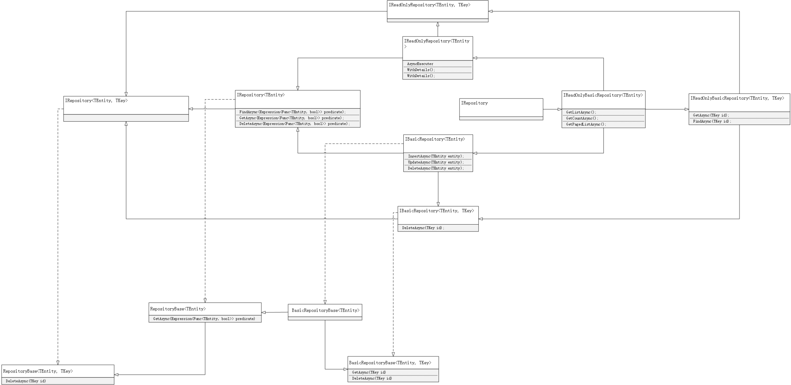

# ORM

## EntityFrameworkCore

讨论EntityFrameworkCore和关系型数据库，从结构上看比较重大的改动在于`MigrationsDbContext`这个迁移上下文，ABP文档对此也有较详细的说明。

### 上下文

主要关注的是查询过滤、工作单元，理解上都较为简单。

### 连接
即数据库连接，提供了标注的模式来简化书写。

`[ConnectionStringName]`标注连接字符串的名称，对应程序配置的`Connection`块。这个查找的回落机制默认即`Default`。

```csharp
[ConnectionStringName("Sample")]
public class SampleDbContext : AbpDbContext<SampleDbContext>
 
    
    
 "ConnectionStrings": {
    "Default": "Server=127.0.0.1;uid=root;pwd=123456;database=LG_Main;Allow User Variables=true;",
    "Sample": "Server=127.0.0.1;uid=root;pwd=123456;database=LG_Platform;Allow User Variables=true;"
  }
```
### 约束

#### 配置约束

综合以往经验对实体配置的需求是：

1. 按表配置
2. 实体属性的字段名称、长度、备注等都通过标注的方式
3. 考虑继承的聚合根属性

虽然ABP推荐`flentApi`，但它明显与实际需求不匹配，故提供的解决方案如下：

1. 以`EntityTypeConfiguration<T>`的方式分散配置

   ```csharp
   //引入配置文件
   builder.ApplyConfigurationsFromAssembly(typeof(..).Assembly);
   
   //单表配置
   public class BookShopConfiguration : IEntityTypeConfiguration<BookShop>
   {
       public void Configure(EntityTypeBuilder<BookShop> builder)
       {
           builder.ToTable(SampleConsts.DbProperties.DbTablePrefix + nameof(BookShop));
           //默认的聚合根属性
           builder.ConfigureByConvention();
       }
   }
   ```

2. 检查属性标注

   ```csharp
   //decimal
   foreach (var model in builder.Model.GetEntityTypes())
   {
       var properties = model.ClrType.GetProperties()
           .Where(c => c.IsDefined(typeof(DecimalPrecisionAttribute), true));
   
       foreach (var prop in properties)
       {
           var attr = prop.GetCustomAttribute<DecimalPrecisionAttribute>();
           builder.Entity(model.ClrType).Property(prop.Name)
               .HasColumnType($"decimal({attr.Precision},{attr.Scale})");
       }
   }
   
   //comment
   foreach (var model in builder.Model.GetEntityTypes())
   {
       var properties = model.ClrType.GetProperties()
           .Where(c => c.IsDefined(typeof(DescriptionAttribute), true));
   
       foreach (var prop in properties)
       {
           if (prop.PropertyType.IsClass && prop.PropertyType != typeof(string))
           {
               continue;
           }
   
           var attr = prop.GetCustomAttribute<DescriptionAttribute>();
          builder.Entity(model.ClrType).Property(prop.Name).HasComment(attr.Description);
       }
   }
   ```


#### 查询约束

这里除了指查询过滤，也指查询拆分表现。前者是在组织LINQ转换SQL时新增查询筛选表达式，后者EntityFrameworkCore文档对它的描述：是否将查询语句拆分在多个线程中查询。

EntityFrameworkCore默认`QuerySplittingBehavior.SingleQuery`，而ABP默认`QuerySplittingBehavior.SpiltQuery`。两者区别是拆分时不能处理关联性的查询，比如LINQ主子JOIN关联。ABP中的LINQ都是单表查询或通过导航属性查询，在本地项目中几乎都是表连接查询，故通常都是要重写。

```csharp
opt.UseQuerySplittingBehavior(
    Microsoft.EntityFrameworkCore.QuerySplittingBehavior.SingleQuery);
```

##### 查询过滤范围

ABP中默认提供的查询过滤包括租户、软删除，在自定义模块中增加了用户、场馆，前者主要在终端中筛选除当前用户数据，后者主要在管理端中筛选当前场馆数据。

是否启动查询过滤可通过配置项进行：

```csharp
            Configure<AbpDataFilterOptions>(options =>
            {
                options.DefaultStates[typeof(IMultiUser)] = new DataFilterState(isEnabled: false);
                options.DefaultStates[typeof(IMultiStadium)] = new DataFilterState(isEnabled: false);
            });
```

## 仓储IRepository

### 默认仓储实现结构图



### 仓储注册

`EntityframeworkCore`模块提供泛型仓储实现，默认仓储注册方式如下：

```csharp
context.Services.AddAbpDbContext<PlatformDbContext>(options =>
{
	options.AddDefaultRepositories(includeAllEntities: true);
});
```
### 仓储特殊问题

#### 扩展或重写

通常不需要重写仓储，除非是有未实现的细节功能，比如阴影属性的查询、排序等。即便是此种类型情况，也推荐

推荐继承泛型仓储再重写或扩展。

#### 批量操作实体
依赖`Z.EntityFramework.Plus.EFCore`实现批量操作

```csharp
public static async Task<int> BatchDeleteAsync<TEntity, TKey>(
 		this IRepository<TEntity, TKey> repository,
    	Expression<Func<TEntity, bool>> predicate)
    	where TEntity : class, IEntity<TKey>

public static async Task<int> BatchUpdateAsync<TEntity, TKey>(
    	this IRepository<TEntity, TKey> repository,
        Expression<Func<TEntity, TEntity>> action,
        Expression<Func<TEntity, bool>> predicate)
        where TEntity : class, IEntity<TKey>
```
#### 查询多个上下文
`EntityFrameworkCore`限制LINQ查询的对象，只能是一个上下文，参见[https://github.com/dotnet/efcore/issues/13775](https://github.com/dotnet/efcore/issues/13775)

#### 工作单元

默认情况下仓储方法是作为工作单元，在正常处理HTTP请求时不易忽略，但在中间件处理或后台线程处理时容易忘记，主要是几种错误情况：

1. 自定义中间件可能通过仓储查询数据，但不通过仓储方法而是LINQ查询
2. 仓储方法是工作单元的，但同时调用的多个仓储方法之间不是工作单元的
3. 后台线程的问题同1