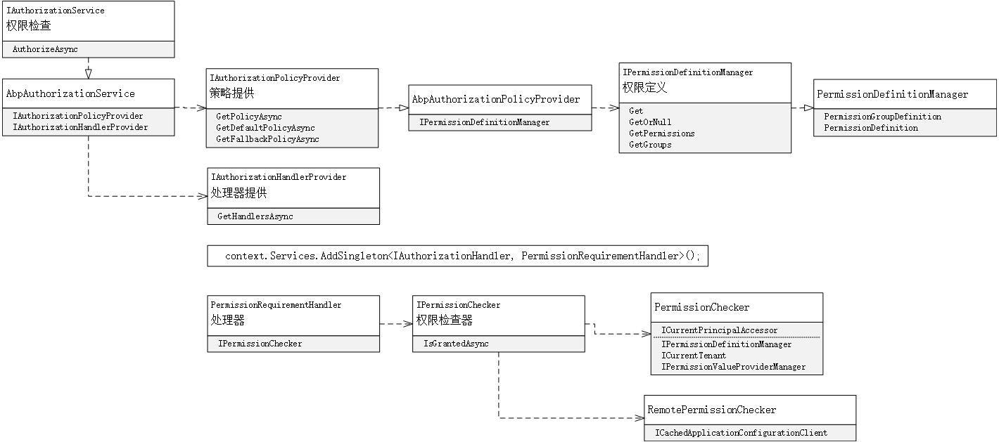

# 权限

主要包含两大块内容，一是定义权限，二是检查权限。

权限通常指检查策略*Policy*是否被授权给用户或角色，ABP也就是基于微软*Identity*思路实现的。

而引申一下，基于*User*及声明，或者*OAuth2*的*Scope*也是可能出现的。



## 权限定义

在考虑定义时，不建议动态新增，动态新增意味着权限不能闭合管理，影响范围扩大。

通常定义的权限都是静态的，它针对的是某个资源的操作是否被允许，其持久通常是常量字符串。

而在ABP的权限结构中通常是这样的：

```csharp
var root = context.AddGroup(”Sample“)
var p = root.AddPermission("Sample_A")	//表
var p1 = p.AddChild("Sample_A_Create")	//表的Crud，这样的数量是很庞大的
```

仍旧是相似的模式，但不比按照如此死板的模式，简单约定一些即可省略这个步骤：

- 约定契约来查找权限的位置
- 约定固定写法来表述权限的结构
- 约定固定名称来表示权限的顺序

```csharp
//约定表的权限都实现IPermissionDefine
public partial class BookStorePermissions : IPermissionDefine
{
    //约定某个业务种类
	public static class Group
    {
    	public const string Default = SamplePermissions.RootName + ".BookStore";
    }

	public MultiTenancySides MultiTenancySide { get; } = MultiTenancySides.Both;
}

public static class BookShop
{
     //约定业务种类下某表的默认权限
    public const string Default = Group.Default + ".BookShop";
    
    //其他权限，不限名称
    public const string Create = Default + ".Create";
    public const string Edit = Default + ".Edit";
    public const string Delete = Default + ".Delete";
    public const string Stop = Default + ".Stop";
}
```
## 权限检查

标注或者注入对象，注意两种检查方式结果一致，但两者在HTTP管道的位置是不一致的：

- 标注式检查-HTTP Authorization中间件

- 注入对象检查-API资源

当然考虑到提升效率，无论本地检查或远程检查都借助缓存实现